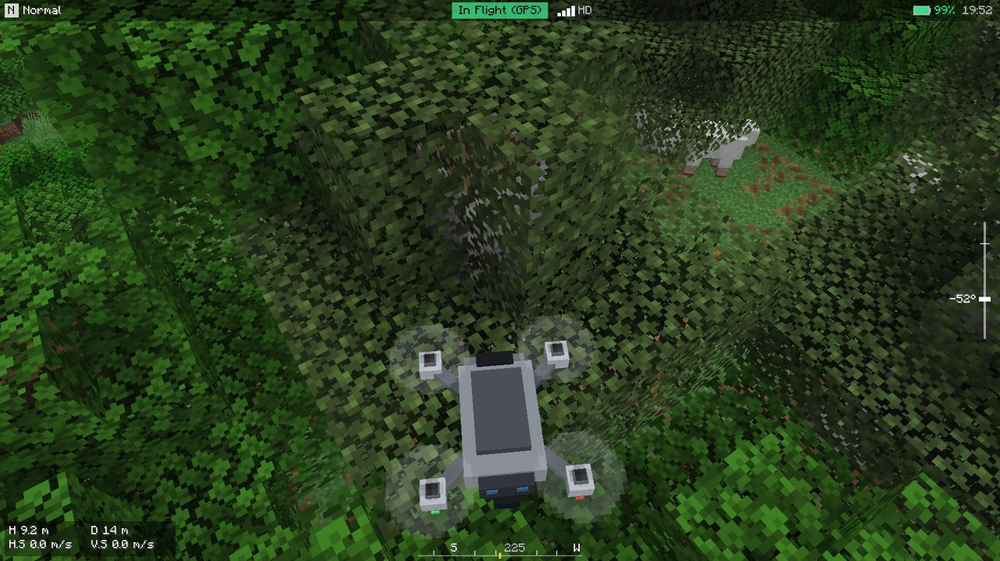
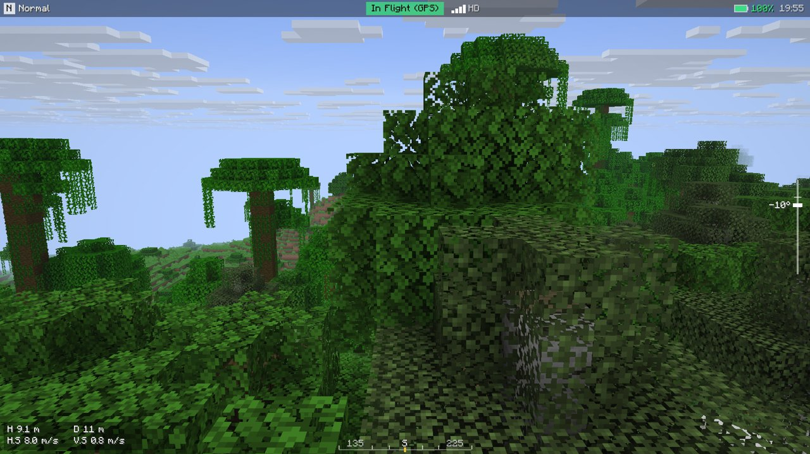
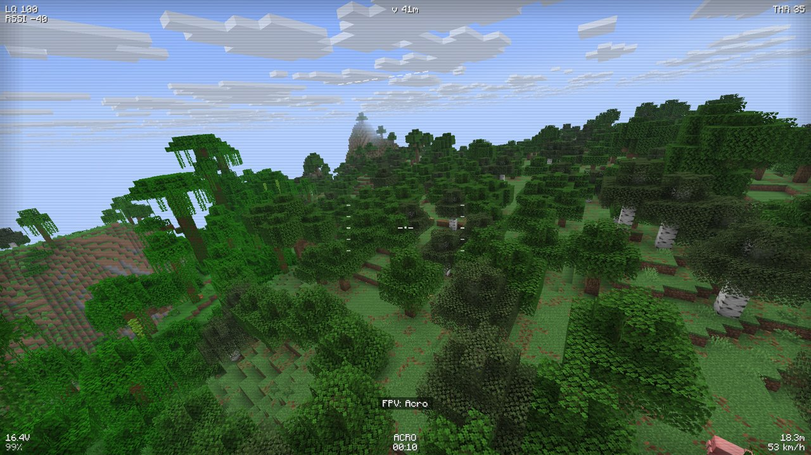
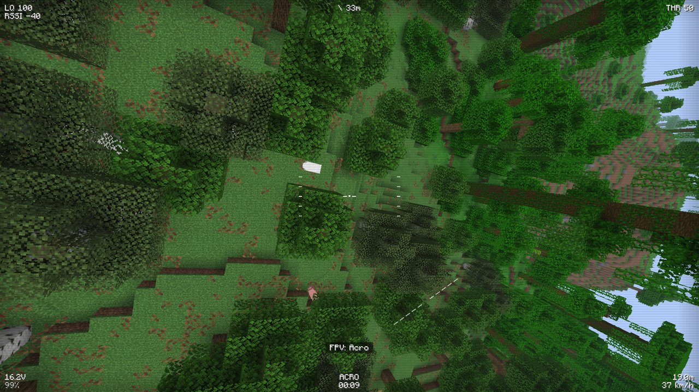
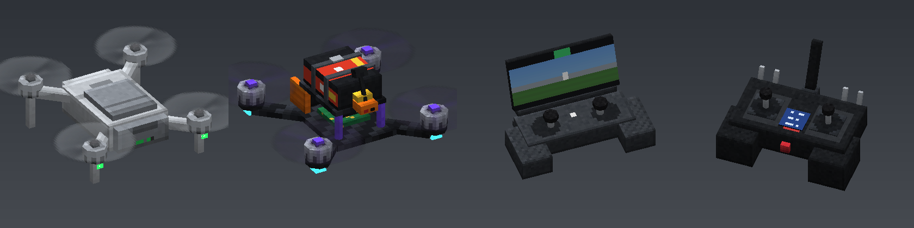

# Free FPV

Дроны вместо свободной камеры — для RP-серверов Minecraft. Запускаешь дрон, камера переходит в него, тело пилота стоит на месте и держит пульт. Два типа аппаратов:

- **Камерный дрон** в духе DJI Mini / Air / Mavic: GPS-стабилизация, висит сам, плавный подвес, зум, интерфейс как в DJI Fly.
- **FPV-квадрик** в духе 5" фристайл-дрона: режимы Angle и Acro, рейты Betaflight, наклон камеры, OSD как в Betaflight, аналоговые помехи.

Управление с клавиатуры и мыши, с геймпада (DualSense, DualShock 4, Xbox, Switch Pro, 8BitDo) и с RC-пульта в режиме USB-джойстика (EdgeTX / OpenTX). Пульты лежат в отдельном 10-м слоте рядом с хотбаром — как инструменты в Axiom.

<p align="center">
  
  
</p>
<p align="center">
  
  
</p>
<p align="center">
  
</p>

## Версии

| Minecraft | Fabric | NeoForge | Статус |
|---|---|---|---|
| 26.3 | ✅ | ✅ | основная версия, проверена в полёте |
| 26.2 | ✅ | ✅ | запускается, миксины проверены |
| 26.1 – 26.1.2 | ✅ | ✅ | запускается, миксины проверены |
| 1.21.11 | ✅ | ✅ | запускается, миксины проверены |
| 1.21 – 1.21.10 | ⏳ | ⏳ | в работе |

Для Fabric нужен [Fabric API](https://modrinth.com/mod/fabric-api).

## Управление

| Действие | Клавиатура / мышь | Геймпад |
|---|---|---|
| Запустить дрон | ПКМ с пультом в слоте инструментов или `B` | зажать Share / Create / View |
| Посадить дрон | `B` | Options / Menu |
| Режим полёта | `N` (на земле — ЛКМ с пультом) | Треугольник / Y |
| FPV ↔ камерный дрон | `M` | Share / Create / View |
| Возврат домой (камерный дрон) | `H` | крестовина влево |
| Подсказка по управлению | `I` | крестовина вправо |
| Слот инструментов (10-й слот) | `0` или прокрутка за 9-й слот | — |
| Колесо инструментов | держать левый `Alt` | — |
| Скрыть OSD | `O` | Квадрат / X |
| Значок записи REC | `R` | Крест / A |
| Подвес: прямо / вниз | `G` | Круг / B |

Все клавиши переназначаются в настройках управления, раздел «Free FPV». При первых запусках слева появляется панель с управлением для текущего режима — она собирается из твоих клавиш, `I` прячет и показывает её.

**Камерный дрон (C / N / S — Cine, Normal, Sport).** WASD двигает дрон, пробел и Shift поднимают и опускают, мышь поворачивает дрон и наклоняет подвес, колесо даёт зум до 4×. Отпустил клавиши — дрон завис. Мышь сглажена, как у настоящего подвеса: в Cine сильнее всего, в Sport почти без сглаживания. В стены не врезается, останавливается, как с датчиками препятствий DJI.

**Возврат домой (RTH).** `H` поднимает камерный дрон на безопасную высоту, разворачивает к пилоту, приводит обратно и сажает в паре блоков перед ним, после чего камера возвращается в тело. Любое движение стиками или повторное `H` возвращает управление. При низком заряде дрон сам летит домой, как DJI. Если путь перекрыт стеной, возврат прерывается с подсказкой.

**FPV (Angle / Acro).** В Angle с клавиатуры дрон держит высоту сам: пробел — набор (нажал — плавно, держишь — полный газ), Shift — снижение, у земли снижение само замедляется, так что посадка мягкая. WASD наклоняет дрон, мышь поворачивает. На полосе газа в OSD отмечено зависание. В Acro газ как на настоящем пульте: остаётся там, где отпустил, мышь крутит тангаж и крен, A/D — рыскание, дрон сам не выравнивается. Удар о блок на скорости или вода — крэш, через пару секунд камера возвращается к пилоту.

**Геймпад.** Mode 2: левый стик — газ и рыскание, правый — тангаж и крен. На камерном дроне L2/R2 наклоняют подвес, L1/R1 дают зум. На FPV крестовина вверх/вниз меняет наклон камеры. Центр газа на геймпаде — зависание (в Angle ещё и с удержанием высоты), для пультов с не-пружинящим газом это отключается в конфиге. Геймпад вибрирует от ударов и крэша, на FPV — лёгкая вибрация моторов; световая панель DualSense / DualShock окрашивается по режиму и мигает при низком заряде.

### Слот инструментов

Рядом с хотбаром появляется 10-й слот, как в Axiom. В нём лежит мультитул — сейчас это пульт камерного дрона или FPV-аппаратура. Выбрать слот: `0`, прокрутка колесом за 9-й слот (или назад за 1-й), быстрое нажатие левого `Alt`. Пока слот активен, ПКМ запускает дрон этого пульта, ЛКМ переключает режим, с которым он взлетит (Cine / Normal / Sport или Angle / Acro). В руке виден сам пульт. Цифры 1–9 возвращают к обычному хотбару.

Удерживай левый `Alt` — откроется колесо инструментов: веди мышью к нужному и отпусти (или кликни ЛКМ). Колесо мыши листает инструменты. Ходить при открытом колесе можно.

Слот чисто клиентский: сервер по-прежнему видит выбранный слот хотбара, а клики, пока активен слот инструментов, уходят инструменту, а не предмету в руке. Какие инструменты доступны, решает сервер (см. ниже), так что в будущем здесь появятся и другие мультитулы — в зависимости от сервера.

## Возможности

- Камера полностью в дроне: позиция, поворот по трём осям с креном, свой FOV (FPV — 118° по горизонтали).
- Камера не видит сквозь блоки: объектив всегда держит зазор от стен, пола и потолка (даже когда дрон прижат к стене или кувыркается после крэша), а ближняя плоскость отсечения в полёте короче ванильной.
- Физика с шагом 240 Гц: тяга, гравитация, сопротивление воздуха, столкновения с блоками, отскоки, падение после крэша.
- Живая картинка: тряска камеры от моторов, скорости и ударов (у камерного дрона её гасит подвес), у камерного дрона в Normal и Sport угол обзора чуть расширяется на скорости.
- Пыль и брызги от пропеллеров у земли и над водой, обломки блока и искры при ударе, дымок после крэша, звук удара о блок.
- Свист ветра на скорости в FPV, писк при низком заряде и слабом сигнале.
- Переходы: запуск — «Подключение…» с затемнением у камерного дрона и рассеивающиеся помехи у FPV, посадка — короткое затемнение.
- Батарея, дальность связи (ограничена прорисовкой), слабый сигнал даёт помехи. У камерного дрона на границе дальности стоит «стена», у FPV дальше — потеря сигнала.
- Звук пропеллеров меняется от нагрузки на моторы.
- Прямо во время полёта работают чат, инвентарь и таб. Хотбар и здоровье на это время скрываются.
- Выход из дрона при получении урона (настраивается).
- Модели в ванильном стиле, пиксель в пиксель как у предметов Minecraft: дрон в духе DJI Mini с подвесом, 5" фристайл-квадрик с карбоновой рамой, стойками, стеком, LiPo и VTX-антенной, пульт DJI с телефоном и FPV-аппаратура. Анимированные пропеллеры (2 лопасти у DJI, 3 у FPV), мигающий статус-светодиод, светящиеся навигационные огни. Слот и колесо инструментов нарисованы как ванильный хотбар и инвентарь.

### Мультиплеер

Если мод стоит на сервере, остальные игроки видят твой дрон в полёте и слышат пропеллеры. Дрон — ванильная `item_display`-сущность, так что сервер ничего лишнего не хранит, а после рестарта брошенные дроны удаляются сами. Без мода на сервере всё работает, но дрон видишь только ты.

Если мод стоит и у других игроков, сервер дополнительно шлёт им телеметрию дронов рядом, и они получают:

- звук пропеллеров по настоящей нагрузке моторов пилота (слышно, как квадрик раскручивается на панч-ауте), затихание после крэша;
- пыль и брызги от чужих дронов у земли, дым после крэша;
- пилота в позе «держит пульт»: обе руки на пульте, в руках модель пульта, пилот камерного дрона смотрит в экран. Работает и без Emotecraft.

**Настройки сервера** — `config/freefpv-server.json`:

- `tools` — какие инструменты получают игроки (`freefpv:camera_remote`, `freefpv:fpv_radio`). Убери строку — инструмент пропадёт из колеса, а сервер перестанет показывать этот тип дрона. Сюда же в будущем добавляются мультитулы других модов;
- `maxRange` — предел дальности полёта в блоках (0 — решает клиент, но не больше 600);
- `shareTelemetry` — рассылать ли игрокам с модом телеметрию для звука, пыли и позы пилота.

### Совместимость

- **[Emotecraft](https://modrinth.com/mod/emotecraft).** Пока летаешь, пилот стоит в позе «держит пульт», другие это видят. Эмоция `FPV Pilot` сама копируется в папку `emotes` при первом запуске, после установки один раз перезапусти игру. Свою эмоцию можно указать в конфиге.
- **Figura.** Интеграция в планах для веток 1.21.x: для 26.x Figura пока не выходила.
- **DualSense.** На 26.3 геймпады читаются через SDL3, на котором теперь работает сам Minecraft. DualSense распознаётся без сторонних программ.

## Настройки

Файл `config/freefpv.json` перечитывается при каждом запуске дрона, игру перезапускать не нужно. Там задаются:

- скорости и ускорения режимов Cine / Normal / Sport, высота возврата домой, автовозврат при низком заряде;
- тяговооружённость, рейты и expo для FPV;
- FOV, наклон FPV-камеры, аналоговые эффекты, сила тряски камеры, расширение FOV на скорости, переходы;
- время работы батареи, дальность, выход при уроне, писк;
- чувствительность и сглаживание мыши, удержание высоты в Angle с клавиатуры, панель подсказок, раскладка стиков (Mode 1 / Mode 2), deadzone, оси RC-пульта, вибрация и световая панель геймпада;
- частицы, свист ветра, поза пилота;
- слот инструментов: включён ли, прокрутка в него с хотбара, выбор в колесе отпусканием клавиши.

Если контроллер не распознаётся, добавь его строку маппинга из [SDL_GameControllerDB](https://github.com/mdqinc/SDL_GameControllerDB) в `config/freefpv/gamecontrollerdb.txt`.

## Сборка

Нужен JDK 25.

```bash
./gradlew build
```

Готовые jar лежат в `versions/<версия>-<загрузчик>/build/libs/`. Проект собран на [Stonecutter](https://stonecutter.kikugie.dev/): одна кодовая база, сборки под разные версии Minecraft и загрузчики. Физика, OSD, колесо инструментов и ввод находятся в `core` и от Minecraft не зависят. Модели, текстуры дронов и пультов и спрайты интерфейса генерируются скриптом `tools/gen_assets.py` (нужны Pillow и numpy): один пиксель текстуры на единицу модели, как у ванильных моделей, у каждого материала своя небольшая палитра.

---

**English.** Free FPV replaces the free camera with a flyable drone for roleplay servers: a GPS-stabilised camera drone (DJI-style, with gimbal, zoom, return to home and a DJI Fly-like HUD) or an FPV quad (Angle with altitude hold / Acro, Betaflight rates and OSD). The remotes live in an Axiom-style 10th tool slot next to the hotbar with a radial tool wheel (hold Left Alt); servers choose which tools their players get. It supports keyboard + mouse, gamepads including DualSense (rumble and light bar, read through SDL3 on 26.3), and RC transmitters in USB joystick mode. The camera never sees through blocks, shakes with motors and impacts, and the world reacts with prop-wash dust, water spray, debris and wind sound. When the mod is on the server, other players see and hear your drone; players who also have the mod hear the real motor load, see prop wash and see the pilot holding the remote (Emotecraft optional). Currently built for Minecraft 26.3 on Fabric and NeoForge.

© BelzeBool. All rights reserved.
